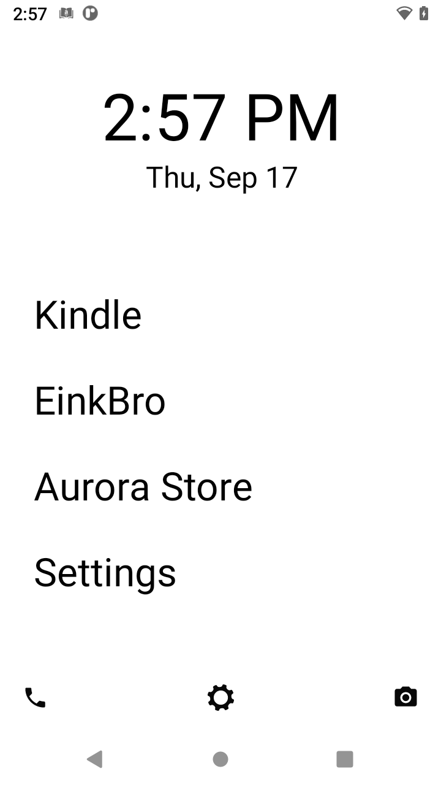
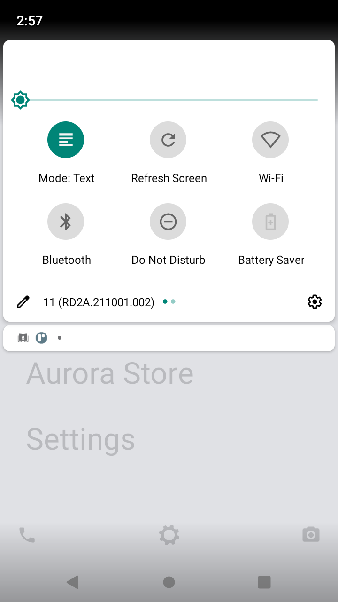
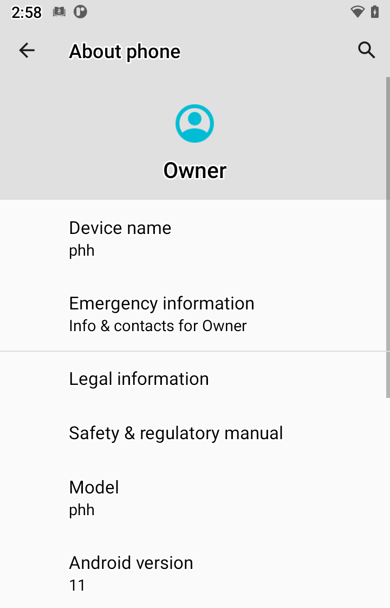
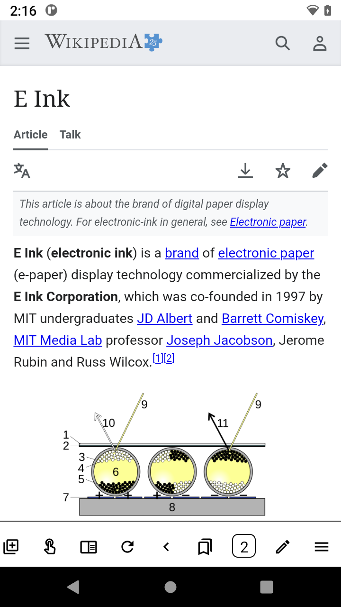
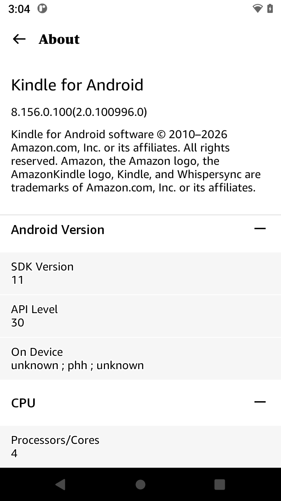
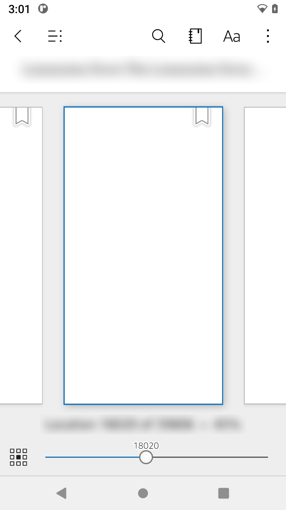
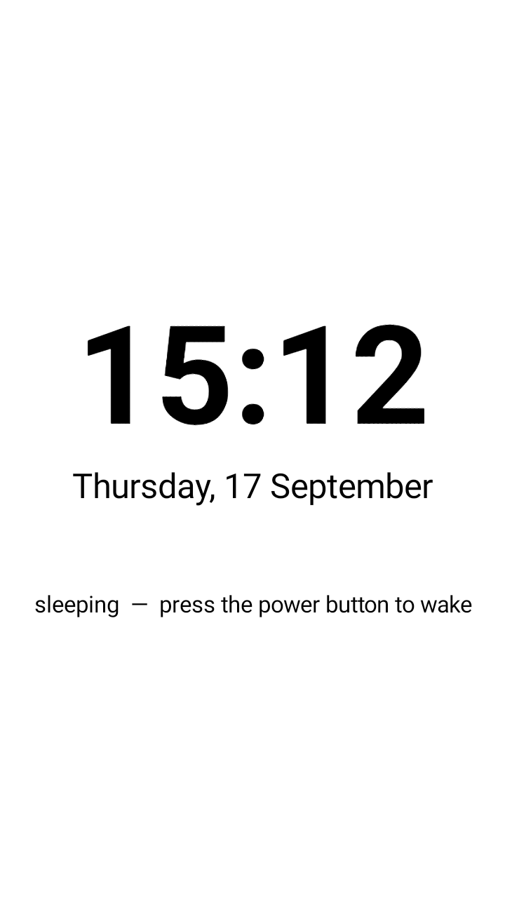

# Android 11 on the Moaan InkPalm 5 Pro Mini (EPD105)

A working Android 11 (phhusson's Treble GSI) on the Moaan InkPalm 5 Pro Mini — Allwinner
B300 (sun8iw15p1), ARMv7, kernel 4.9, 5.2" 1280×720 E Ink — plus a working TWRP with ADB,
display and touch.  Stock firmware is Android 8.1.

**What works:** boots, E Ink panel (correct orientation, no mirroring), touch, Wi-Fi, ADB from
boot, Quick Settings tiles for the panel's Text/Graphics waveform and a manual full refresh,
volume buttons as page-turn keys, the capacitive logo as Home/wake, Unlauncher, Kindle,
EinkBro, Aurora Store.  **Untested:** audio (declared, no speaker, nothing played yet), Bluetooth (declared, kept
off), long-term battery life (short suspend measurements below).  No NFC/GPS hardware; telephony is declared but
absent (PHH no-RIL).

**Prebuilt images:** https://github.com/at10ti0n/inkpalm5-android11/releases/tag/v1 (verify SHA256SUMS).
The repository itself is *builders and sources*: each script takes **your
own** stock `boot.img` / `recovery.img` (hash-checked) and produces the modified image.
Nothing proprietary is redistributed — not Moaan's partitions, not E Ink's waveform/VCOM
calibration (`/private`, never touch it), not the GSI (download it from phhusson).

## Screenshots (Android 11 on the device, captured via `screencap` -- the composed frame the panel shows)
| Home (Unlauncher) | Quick Settings: E-Ink tiles | About: Android 11 |
|---|---|---|
|  |  |  |

| EinkBro | Kindle about (8.156 on API 30) | Kindle reader (title blurred; page content is DRM-protected) |
|---|---|---|
|  |  |  |

| v1 custom sleep page (post-v1 native AOD uses the SystemUI clock) |
|---|
|  |

Panel photos: `docs/images/android11-portrait.jpg` (working) and `docs/images/first-boot-mirrored.jpg` (first boot, before the composer fix).

## How it works (the parts that took weeks to find)
* **TWRP was blank on this device** because TWRP's Android-9 `init` only creates
  `/dev/block/by-name/*` when the bootloader passes `androidboot.boot_devices` — Moaan's
  8.1 vendor init makes those links itself.  Fifteen `symlink` lines in the recovery rc fix
  every mount (`twrp/`).  The panel wants a *transpose* of TWRP's portrait surface and the
  Goodix touch axes are swapped: `twrp/preload/libepdfix.c` interposes both inside the
  recovery binary via `LD_PRELOAD` (source patch for a real rebuild in `twrp/overlay/`).
* **Android 11 boots on the stock 8.1 boot ramdisk** with a two-byte permissive-init patch;
  the GSI's own init is never used (`a11boot/mkboot.py`).
* **The vendor composer reflects every frame** along the panel's long axis and no rotation
  can cancel a reflection.  `a11boot/libhwcflip.c`, preloaded into the composer service,
  mirrors each `DISP_EINK_UPDATE2` layer into a private ION buffer ring before the ioctl.
* **Rotation and touch**: do *not* use `ro.surface_flinger.primary_display_orientation`
  (InputReader then transposes touch).  Keep the display natural and lock Android's user
  rotation (`configs/configure-native.sh`) with an input config marking the Goodix panel as
  an orientation-aware touchscreen (`configs/Vendor_dead_Product_beef.idc`).
* **E Ink refresh control**: the vendor HWC reads `persist.sys.mRefreshMode` per frame and
  `persist.sys.canRefresh=1` as a one-shot full refresh (Ghidra decompile, see
  `docs/REFRESH-CONTROL.md`).  Stock's two modes are Text = 2 (DU) and Graphics = 132.
  `einktile/` is a tiny Quick Settings app that flips them.
* **ADB in Android 11**: v1 uses PHH's script-launched fallback (`adb root` breaks it).
  The post-v1 [second pass](docs/NATIVE-A11-SECOND-PASS.md) restores init-managed
  ADB, including working root/unroot restarts.

**Post-v1 native configuration:** see [the first-pass update](docs/NATIVE-A11-FIRST-PASS.md) for persistent portrait, native AOD, and separate power/page-key layouts. The [second-pass update](docs/NATIVE-A11-SECOND-PASS.md) restores kernel suspend with AOD and native USB/ADB. Published v1 prebuilts still use the earlier workarounds.

## Quirks and workarounds (where native Android 11 did not work here, and what was built instead)
Each entry: the native mechanism that should have done the job, what actually happened on this
device, the workaround shipped, and the cleaner fix if someone wants to do it properly.

| # | Native mechanism | What happened on EPD105 | Workaround shipped | Proper fix |
|---|---|---|---|---|
| 1 | Android 9+ `init`/ueventd creates `/dev/block/by-name/*` from `androidboot.boot_devices` or the DT `firmware/android` node | Neither exists; every by-name mount in TWRP failed for a month (blank logo) | 15 `symlink` lines in the recovery rc from the fixed `partitions=` cmdline map | Bootloader/DT `boot_devices`; or a vendor-style init that makes the links |
| 2 | minui framebuffer backend (`/dev/graphics/fb0`) | The panel is not driven by fb0; it needs a Y8 buffer through `DISP_EINK_UPDATE2` on `/dev/disp`, transposed, and the Goodix axes are swapped | `libepdfix.so` LD_PRELOAD inside `recovery` (transpose + axis swap) | Rebuild TWRP with `twrp/overlay/` (EPD backend + `RECOVERY_TOUCHSCREEN_SWAP_XY`) |
| 3 | GSI's own Android 11 `init` (apexd, linkerconfig) | Never used: the stock 8.1 boot ramdisk `init` runs the GSI; PHH's rc does flattened apex binds | 2-byte permissive-init patch + prepended rc (`a11boot/`) | Proper Android 11 boot image / vendor SELinux policy |
| 4 | Vendor HWC presents SurfaceFlinger's client target | It reflects every frame along the panel's long axis; no rotation cancels a reflection | `libhwcflip.so` LD_PRELOAD into the composer service: copy-mirror each UPDATE2 layer into a private ION ring | Fix in the vendor HWC (no source) or a corrected panel/G2D path |
| 5 | `ro.surface_flinger.primary_display_orientation` | Rotates the picture but InputReader sees viewport orientation 0 -> touch transposed | Natural 1280x720 + fixed-to-user portrait settings (`configs/configure-native.sh`) + orientation-aware `.idc` | HWC/display config reporting the panel as portrait, so input and SF agree |
| 6 | `user_rotation` setting persistence | SystemUI can copy startup landscape into a locked rotation preference | Post-v1: fixed-to-user rotation + sensor policy enabled preserves portrait; no polling | Native settings tested; brief landscape startup remains. See first-pass notes |
| 7 | Apps that request the *natural* orientation (Launcher3, some readers) | Letterboxed into a 720x405 box because natural is landscape | Launcher3 `pref_allowRotation`; per-app for others | Same as 5 |
| 8 | Framework USB gadget setup | Missing executable path and competing PHH daemon starts broke native ADB | v1 uses script-launched ADB | Post-v1: executable symlink and scoped PHH RC patch restore the native ffs.ready/UDC chain; root/unroot tested. See second-pass notes |
| 9 | `SurfaceControl.setRefreshMode` / `forceGlobalRefresh` (stock Allwinner SF binder API used by stock apps) | Absent in AOSP SurfaceFlinger; the stock SystemUI tile broadcasts `android.eink.force.refresh` to nobody | The HWC reads `persist.sys.mRefreshMode` per frame and `persist.sys.canRefresh=1` as a one-shot; `einktile` writes them via su; `persist.display.gu16_max_limit` auto-refreshes | An app-facing refresh API (HAL extension or a small system service) |
| 10 | Always-On Display / doze as a sleep screen | Correction: DozeService runs, but the always-on capability was false | Post-v1: capability RRO enables native AOD; ordinary 2-minute timeout replaces SleepActivity polling | Post-v1 second pass: HAL startup timing + static power RRO restore kernel suspend; 15 successful suspends in a short AOD test |
| 11 | Volume keys in reading apps | No common key: Kindle turns on DPAD/Space, WebView on Page keys | System-wide `.kl`: Vol Down = SPACE, Vol Up = DPAD_LEFT | Per-app remap (Key Mapper) |
| 12 | Separate key layouts per input device | Shared ID layout matched power, page keys and sunxi-gpadc0 | Post-v1: device-name layouts for sunxi-keyboard and pmu1736-powerkey | Native name lookup works after removing the shared ID override; no driver change |
| 13 | Capacitive Moaan logo as a gesture area | The touch controller reports it as one key (`KEY_HOMEPAGE`), no coordinates | HOME + WAKE via `.kl` | Controller firmware/driver change |
| 14 | Framework `exec` in the 8.1 init | Temporary `exec` children never ran (Gate 1F a6) | Declared oneshot/long-running services only | -- |
| 15 | Telephony | Vendor declares GSM/IMS it has no hardware for | PHH no-RIL; phone process idle | Vendor manifest without telephony |
| 16 | Screenshots of DRM readers | Kindle's reader surface is secure: screencap shows white | -- | -- |

## Layout
    twrp/       mktwrp.py + twrp-epd105-ramdisk.cpio.gz + libepdfix.c + overlay patch
    a11boot/    mkboot.py + a11-prepend.rc + libhwcflip.c + wdog.c
    configs/    configure-native.sh, bounded boot fixups, named key layouts, touch idc
    overlays/   native AOD capability overlay builder
    einktile/   Quick Settings tiles (build.sh: Android build-tools + JDK 11)
    docs/       FLASHING.md (read first), REFRESH-CONTROL.md, twrp-boot-review.md, images/

## Credits
phhusson (Treble GSI, superuser), TeamWin (TWRP), jkuester (Unlauncher), plateaukao
(EinkBro), Aurora OSS, philips/inkpalm-5-adb-english (the ADB starting points), the
linux-sunxi wiki.  Built with Claude Code doing the reverse engineering alongside a human
holding the buttons.

## License
GPL-2.0 for everything in this repository (the TWRP overlay must be; the rest follows).
No warranty.  This can brick a device: read `docs/FLASHING.md` and keep your stock images.

## Discussion
r/InkPalm5 thread: https://www.reddit.com/r/InkPalm5/comments/1wirslw/android_11_running_on_the_moaan_inkpalm_5_pro/
Issues and pull requests welcome here; results from other units especially.
