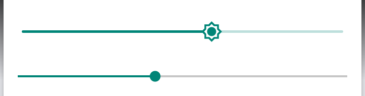

# Front light (brightness + warmth) on Android 11 -- EPD105

Stock 8.1 had two sliders (cold light, warm light).  On the GSI neither the brightness
slider nor anything else lit the panel.  Fixed 2026-09-17; this is what was found and built.

## Hardware and what the vendor stack does with it
* TI **LM3630A** two-bank LED driver on i2c-2 @ 0x36 (`/sys/bus/i2c/devices/2-0036`,
  kernel driver `lm3630a_bl`, chip-enable GPIO 360 high).  Bank A/B = cold/warm.
  Both banks run in PWM mode (CONFIG 0x01 = 0x1b); one SoC PWM (`s_pwm` pwm-0, 32 kHz)
  is the shared dimmer, the per-bank brightness registers set the mix.
* `/sys/class/backlight/lm3630a_led{a,b}` exist but are inert here (writes set the PWM
  duty only; `actual_brightness` stays 0).
* The vendor **lights HAL module** `/vendor/lib/hw/lights.virgo.so` ("SoftWinner lights
  Module") never touches the LM3630A: it sends the backlight value to `/dev/disp`
  (`disp` sysfs shows `backlight( n)` following the slider) -- the LCD backlight path of
  the reference design, which goes nowhere on this board.  So on Android 11 the native
  slider -> `LightsService` -> `android.hardware.light@2.0-service` -> `lights.virgo.so`
  chain was complete and functional; it just ended in the wrong place.
* Stock SystemUI bypassed the HAL.  `com.android.systemui.moan.FunctionSettingsControl.
  setLedValue(cold, warm)` (decompiled from the stock odex; stock `/system/priv-app/
  SystemUI`) writes five world-writable procfs nodes the Moaan kernel adds:
  ```
  /proc/lm3630a/pwm_level        0..255 shared PWM duty (0 = PWM off)
  /proc/lm3630a/leda_max_cur     0..7   cold bank full-scale current
  /proc/lm3630a/leda_brightness  0..255 cold bank brightness register (+ bank enable)
  /proc/lm3630a/ledb_max_cur     0..7   warm bank full-scale current
  /proc/lm3630a/ledb_brightness  0..255 warm bank brightness register (+ bank enable)
  ```
  from five 25x25 lookup tables (`led107.LedParamControl`: `PWM_VALUE`, `COLD_CURRENT`,
  `COLD_BRIGHTNESS`, `WARM_CURRENT`, `WARM_BRIGHTNESS`, indexed `[warm][cold]`, levels
  0..24).  The tables are what make a "cold 12, warm 0" and a "cold 12, warm 20" look the
  same brightness on the cold side despite the shared PWM.  They are reproduced verbatim in
  `frontlight/frontlight_tables.h` (extracted programmatically from the class initializer).
  Stock also persisted `mogu_cold_led_value` / `mogu_warm_led_value` in Settings.Global
  and turned both banks off on sleep.

## The fix: a lights HAL module that drives the real hardware
`frontlight/lights_epd105.c` -> `lights.virgo.so` replaces the vendor module (same legacy
`hw_module_t`/`light_device_t` contract, so the untouched `light@2.0-service` and framework
keep working; only `backlight` is offered, other light types report unavailable exactly as
before).  Per call:

* framework backlight value b (0..255) -> **cold level** `1 + (b-11)*24/245` for b > 10,
  i.e. the native brightness slider is the cold light;
* **warm level** = `persist.sys.frontlight.warm` (0..24), re-read on every call;
* the five proc nodes are written in stock order from the stock tables.

**Off rule.** The framework never sends 0 while the display dozes (AOD sleep screen): it
clamps the doze brightness to `config_screenBrightnessSettingMinimum`, which on the GSI is
10 -- and 10 is also the lowest value the slider can produce (MEASURED: doze -> backlight
10; slider fully left -> 10).  On an E-Ink reader "as dim as it goes" is off, so the HAL
treats b <= 10 as both banks off.  Result: slider fully left = light off, sleep = light
off, wake = restored, no polling, no framework change.  Override with
`persist.sys.frontlight.off_at` if a different build has a different minimum.

**Warmth UI.** einktile v3 adds a **Warmth** Quick Settings tile (0..24 slider dialog).
It writes the property and then nudges `screen_brightness` by one step and back so the
framework re-issues the backlight call and the HAL re-applies with the new warm level.
Verified end-to-end (`logcat -s lights.epd105`):
```
backlight 128 -> cold 12 warm 10      slider 0.5
backlight 129 -> cold 12 warm 20      Warmth tile 20:  leda_brightness 110, ledb 147
backlight 129 -> cold 12 warm 0       Warmth tile 0:   leda_brightness 158, ledb 0
backlight 10  -> cold 0  warm 0       doze / slider minimum: all nodes 0
backlight 255 -> cold 24 warm 10      slider max: pwm 255, leda 222, ledb 209
```

## Install
```
armv7a-linux-androideabi28-clang -shared -fPIC -O2 -Wl,-z,now -o lights.virgo.so \
    frontlight/lights_epd105.c -llog                       # or use the release binary
adb push lights.virgo.so /sdcard/
adb shell su -c 'mount -o remount,rw /vendor;
  cp -p /vendor/lib/hw/lights.virgo.so /vendor/lib/hw/lights.virgo.so.stock;   # once
  cp /sdcard/lights.virgo.so /vendor/lib/hw/lights.virgo.so;
  chmod 644 /vendor/lib/hw/lights.virgo.so; chcon u:object_r:vendor_file:s0 /vendor/lib/hw/lights.virgo.so;
  setprop persist.sys.frontlight.warm 10; sync; reboot'
adb install -r einktile/build/einktile.apk      # v3, adds the Warmth tile (add it in QS edit)
```
Reboot rather than restarting `light-hal-2-0`: `system_server` keeps the dead HIDL proxy
and silently drops backlight calls until it is restarted (MEASURED).
Rollback: copy `lights.virgo.so.stock` back.  The stock module is vendor-proprietary and
is not in this repo.

## Not done / notes
* Which physical bank is cold vs warm follows the stock table names (`leda` = cold).
  If a unit shows the opposite, swap the two `_brightness`/`_max_cur` pairs in `apply()`.
* The stock `ContrastControl` writes `/sys/kernel/debug/dispdbg/gamma_lvl` -- the 8.1
  "contrast" setting.  Not wired up yet; same shape of fix if wanted.
* Cold levels 1..24 are a linear map of the slider; the stock UI had 24 discrete steps,
  so nothing is lost, but the slider's lowest visible step is level 1 at value 11.

## Warmth as a Quick Settings slider (2026-09-18)

The Warmth tile opened a dialog; warmth now has its own slider line in the Quick Settings
panel, directly under the brightness line.



Quick Settings custom tiles cannot render a slider -- a tile is an icon and a label, and an
RRO can replace resources but cannot add the code to drive a new control. So this is a real
SystemUI patch, kept as small as it can be:

* `systemui/WarmthSliderView.java` -- a `SeekBar` subclass that wires **itself** up in its
  constructor: reads `persist.sys.frontlight.warm`, writes it on change, then nudges
  `Settings.System.SCREEN_BRIGHTNESS` by one step and back so the framework re-issues the
  backlight call and the lights HAL re-applies with the new warmth. Applies on a 300 ms
  throttle while dragging (each apply costs a panel refresh) and once on release.
* `systemui/quick_settings_brightness_dialog.xml` -- the stock brightness layout with the
  original `ToggleSliderView` untouched (same id, size and weight) inside a vertical wrapper,
  plus the new view as a second row. Both rows are labelled: **Brightness** with `-` / `+` at
  the ends, **Screen Temperature** with **Cool** / **Warm**. "Brightness" reuses SystemUI's
  own localised `quick_settings_brightness_label`; the rest are literals, so this is
  English-only. Both rows share 8dp side padding and 52dp end-label widths so the two tracks
  line up (they differ by ~4dp in practice -- `ToggleSliderView` carries internal padding a
  bare `SeekBar` does not).
  **Nothing here declares an `android:id`**, so no new resource is added and the resource
  table is unchanged; the view finds its own state, so `QSPanel` needs no patch at all.
* `systemui/patch-systemui.sh` -- does the whole build: compiles the class, converts it to
  smali, decompiles SystemUI, drops both in, rebuilds, signs with the platform key and
  **refuses to emit an APK whose certificate does not match the original**.

SystemUI runs as `android.uid.systemui` (uid 10138), not uid 1000, so it cannot normally set
a `system_prop` like `persist.sys.frontlight.warm`. It works here because this port runs
SELinux **permissive** (a consequence of the permissive-init patch, quirk 3) -- property
service logs the denial and allows the write. On an enforcing build the slider would need to
hand the value to the einktile app (uid 1000) by broadcast instead. The Warmth **tile** is
still shipped and still works, both as that fallback and for anyone who would rather not
patch SystemUI.

Measured on the device, dragging the slider end to end:

```
slider  0  -> leda_brightness  90, ledb_brightness   0   (cold bank only)
slider 10  -> leda_brightness 139, ledb_brightness  88
slider 19  -> leda_brightness 109, ledb_brightness 104
slider 24  -> leda_brightness   0, ledb_brightness  69   (warm bank only)
```

### Dark theme
The row uses `?android:attr/textColorPrimary` rather than a fixed colour, so it follows the
system light/dark theme like the rest of the panel (verified: labels render white on black
with `cmd uimode night yes`). Android 11's dark theme works OS-wide on this port.

### Why this is not a prebuilt
A patched SystemUI only matches the exact GSI build it was decompiled from, so shipping a
binary would silently pin everyone to one GSI image. `patch-systemui.sh` takes **your own**
`SystemUI.apk` and `framework-res.apk`, the same rule the TWRP and boot builders follow.
Note that `apktool` also folds redundant `-vNN` resource qualifiers on rebuild (about 890
directories here, e.g. `res/anim-v21` -> `res/anim`); that is expected -- SystemUI's minSdk
is 30, so those qualifiers always applied anyway.
